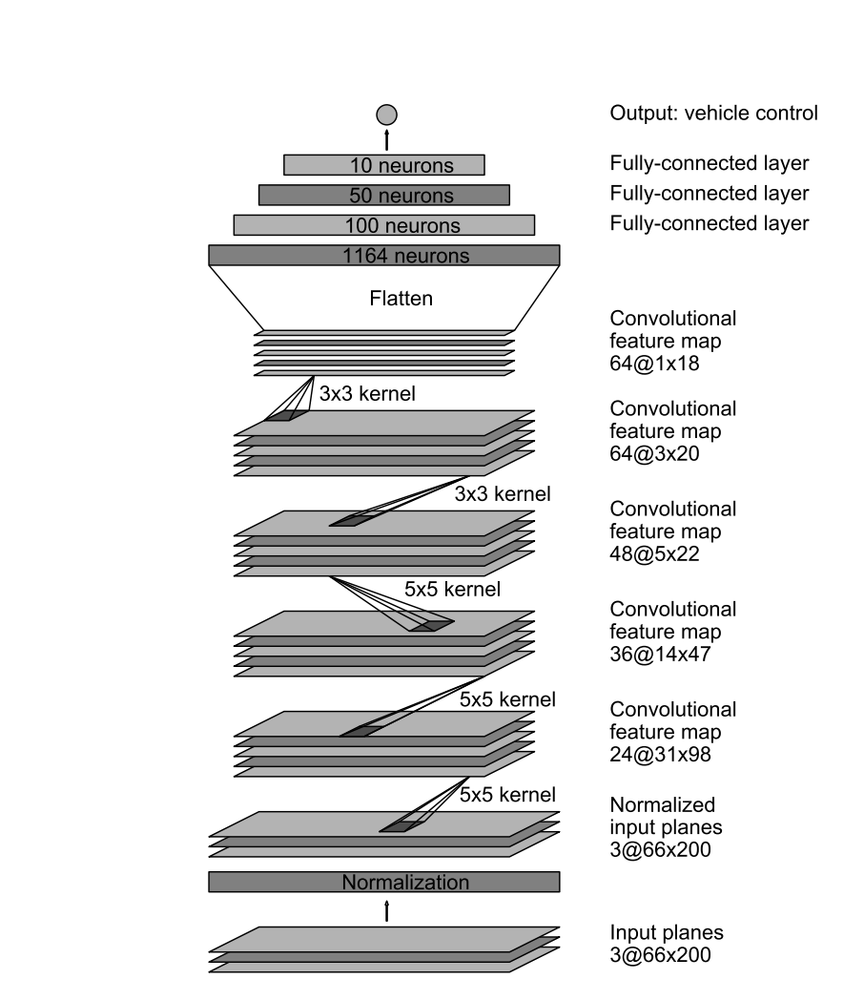
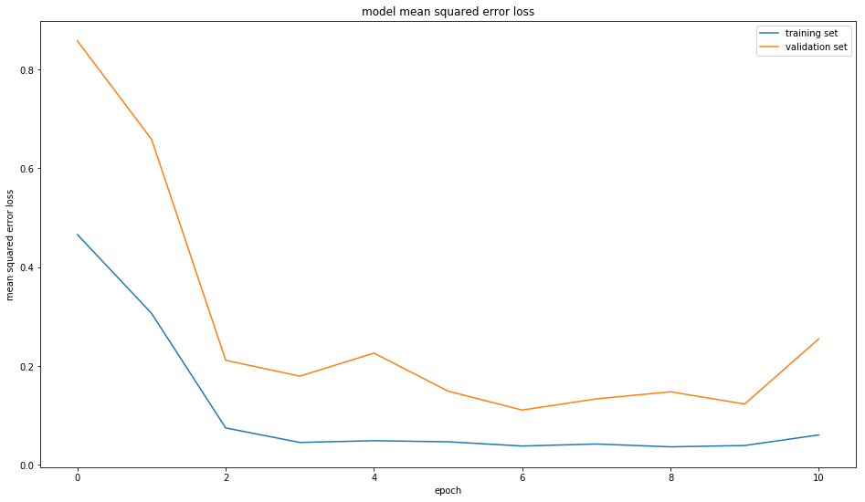
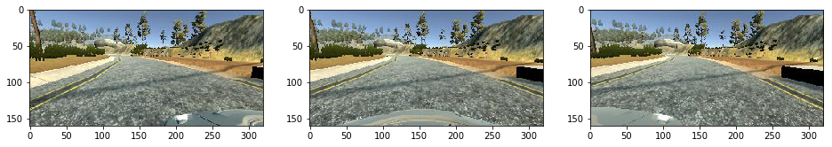

# Behavioral Cloning

This is my writeup of the behavioral cloning project of the Udacity self driving car nanodegree.

Unless you are grading this project, I would recommend reading the BehavioralCloning.ipynb notebook, as it contains the same information as written here.

### Behavioral Cloning Project

The goals / steps of this project are the following:
* Use a driving simulator to collect data of good driving behavior
* Build, a convolution neural network in Keras that predicts steering angles from images
* Train and validate the model with a training and validation set
* Test that the model successfully drives around track one without leaving the road
* Summarize the results with a written report


## Rubric Points
 Here I will consider the [rubric points](https://review.udacity.com/#!/rubrics/432/view) individually and describe how I addressed each point in my implementation.  

---
### Files Submitted & Code Quality

#### 1. Submission includes all required files and can be used to run the simulator in autonomous mode

My project includes the following files:
* **BehavioralCloning.ipynb** containing the script to create and train the model. I used a notebook instead of a python script because I think that improves the reproducibility.
* drive.py for driving the car in autonomous mode, only removed the output to console from this file.
* **model_v1_1.h5** containing a trained convolution neural network. This file is too big for the 100 MB github limit, so I uploaded it to amazon S3. It can be downloaded with this link: https://s3-eu-west-1.amazonaws.com/fabian.hertwig.carnddata/model_v1_1.h5
* **v1_1.mp4** a video showing the car autonomously driving the trak.
* **writeup_report.md** summarizing the results

#### 2. Submission includes functional code
Using the Udacity provided simulator and my drive.py file, the car can be driven autonomously around the track by executing
```sh
python drive.py model_v1_1.h5
```

#### 3. Submission code is usable and readable

The BehavioralCloning.ipynb file contains the code for training and saving the convolution neural network. The file shows the pipeline I used for training and validating the model, and it contains comments to explain how the code works.

### Model Architecture and Training Strategy

#### 1. An appropriate model architecture has been employed

I copied the model architecture of the  [NVidia Model for self driving cars](https://arxiv.org/pdf/1604.07316v1.pdf), as it solves the same problem - predicting a steering angle from pictures of a windshield mounted camera - and used the same left, center, right camera strategy.

I got pretty good results with this architecture from the beginning, but the car had problems in the steep corners, even after adding images to counteract the model behavior. I saw that my model was overfitting so I added dropout layers. Then the model was able to drive around the track in both directions.

Also layers to crop and normalize the images are added as first layers.

The following image shows the architecture of the original NVidia Model.


This is the code to create the model:

```python
model = Sequential()

model.add(Cropping2D(cropping=((50,10), (0,0)), input_shape=images.shape[1:4]))
model.add(Lambda(lambda x: (x / 255.0) - 0.5))

model.add(BatchNormalization(epsilon=0.001, mode=2, axis=1))

model.add(Convolution2D(24,5,5,border_mode='valid', activation='relu', subsample=(2,2)))
model.add(Dropout(0.5))
model.add(Convolution2D(36,5,5,border_mode='valid', activation='relu', subsample=(2,2)))
model.add(Dropout(0.5))

model.add(Convolution2D(48,5,5,border_mode='valid', activation='relu', subsample=(2,2)))
model.add(Dropout(0.5))

model.add(Convolution2D(64,3,3,border_mode='valid', activation='relu', subsample=(1,1)))
model.add(Dropout(0.5))

model.add(Convolution2D(64,3,3,border_mode='valid', activation='relu', subsample=(1,1)))
model.add(Dropout(0.5))

model.add(Flatten())
model.add(Dense(1164, activation='relu'))
model.add(Dense(100, activation='relu'))
model.add(Dense(50, activation='relu'))
model.add(Dense(10, activation='relu'))
model.add(Dense(1, activation='tanh'))

model.compile(optimizer="adam", loss="mse")
```


This is the keras summary:

    ___________________________________________________________________________________________________
    Layer (type)                     Output Shape          Param #     Connected to                     
    ====================================================================================================
    cropping2d_1 (Cropping2D)        (None, 100, 320, 3)   0           cropping2d_input_1[0][0]         
    ____________________________________________________________________________________________________
    lambda_1 (Lambda)                (None, 100, 320, 3)   0           cropping2d_1[0][0]               
    ____________________________________________________________________________________________________
    batchnormalization_1 (BatchNorma (None, 100, 320, 3)   400         lambda_1[0][0]                   
    ____________________________________________________________________________________________________
    convolution2d_1 (Convolution2D)  (None, 48, 158, 24)   1824        batchnormalization_1[0][0]       
    ____________________________________________________________________________________________________
    dropout_1 (Dropout)              (None, 48, 158, 24)   0           convolution2d_1[0][0]            
    ____________________________________________________________________________________________________
    convolution2d_2 (Convolution2D)  (None, 22, 77, 36)    21636       dropout_1[0][0]                  
    ____________________________________________________________________________________________________
    dropout_2 (Dropout)              (None, 22, 77, 36)    0           convolution2d_2[0][0]            
    ____________________________________________________________________________________________________
    convolution2d_3 (Convolution2D)  (None, 9, 37, 48)     43248       dropout_2[0][0]                  
    ____________________________________________________________________________________________________
    dropout_3 (Dropout)              (None, 9, 37, 48)     0           convolution2d_3[0][0]            
    ____________________________________________________________________________________________________
    convolution2d_4 (Convolution2D)  (None, 7, 35, 64)     27712       dropout_3[0][0]                  
    ____________________________________________________________________________________________________
    dropout_4 (Dropout)              (None, 7, 35, 64)     0           convolution2d_4[0][0]            
    ____________________________________________________________________________________________________
    convolution2d_5 (Convolution2D)  (None, 5, 33, 64)     36928       dropout_4[0][0]                  
    ____________________________________________________________________________________________________
    dropout_5 (Dropout)              (None, 5, 33, 64)     0           convolution2d_5[0][0]            
    ____________________________________________________________________________________________________
    flatten_1 (Flatten)              (None, 10560)         0           dropout_5[0][0]                  
    ____________________________________________________________________________________________________
    dense_1 (Dense)                  (None, 1164)          12293004    flatten_1[0][0]                  
    ____________________________________________________________________________________________________
    dense_2 (Dense)                  (None, 100)           116500      dense_1[0][0]                    
    ____________________________________________________________________________________________________
    dense_3 (Dense)                  (None, 50)            5050        dense_2[0][0]                    
    ____________________________________________________________________________________________________
    dense_4 (Dense)                  (None, 10)            510         dense_3[0][0]                    
    ____________________________________________________________________________________________________
    dense_5 (Dense)                  (None, 1)             11          dense_4[0][0]                    
    ====================================================================================================
    Total params: 12,546,823
    Trainable params: 12,546,623
    Non-trainable params: 200
____________________________________________________________________________________________________


#### 2. Attempts to reduce overfitting in the model

The model contains dropout layers in order to reduce overfitting.

The model was trained and validated on different data sets to ensure that the model was not overfitting. This was implemented by settings the shuffle_split parameter in the keras fit function. Also an [early stopping](https://keras.io/callbacks/#earlystopping) callback was used to stop training if the validation accuracy would not improve over three epochs. Also only the best model gets saved during training. So if the validation error does not improve in later epochs, the model generated in an earlier epoch gets saved.

Here is a graph showing the training and validation error. The model is overfitting after epoch 6. But only the best model is saved and in that case it is epoch 6.



The model was tested by running it through the simulator and ensuring that the vehicle could stay on the track.

#### 3. Model parameter tuning

The model used an adam optimizer, so the learning rate was not tuned manually.

#### 4. Appropriate training data

In the simulation three forward facing cameras are mounted on the cars windshield. One on the left, one in the center and one on the right. All three cameras are used to capture training data. But only the center camera is used to drive the car around the track. Also the steering angle is recorded for training.



I trained the model using the center image and the recorded steering angle. I also used the left and right images and added (or subtracted) a constant of 0.2 to the steering angle for the left (and right) image. I also mirrored these images vertically and flipped the steering angle sign to add additional training data.

The original images are sampled at 60fps, but I did not want to use too similar images. So I only read every third image and therefore reduced the samplerate to 20 fps.

I drove two times around the track in the clockwise direction and two times in the counter clockwise direction and tried to stay in the middle of the track. I used the mouse to steer to generate better steering angles. Then I tried to capture some special situations, mostly when the car is at the very side of the track and is steered towards the center.

After training the first good model the car had problems in the corners where it could see water in front of it. So I captured extra images avoiding these situations. With that data the current model Version 1.1 was generated. When the model drives the car in the backward direction, there is one corner where the car gets very close to the edge and then stays there for a few seconds. I captured images to prevent this situation, but these some how mess up my model. When I train the model with these images, the car is not able to even drive around the first corner. So I did not try to further improve the version 1.1 model, which is able to drive around the trak (with one sloppy corner).
